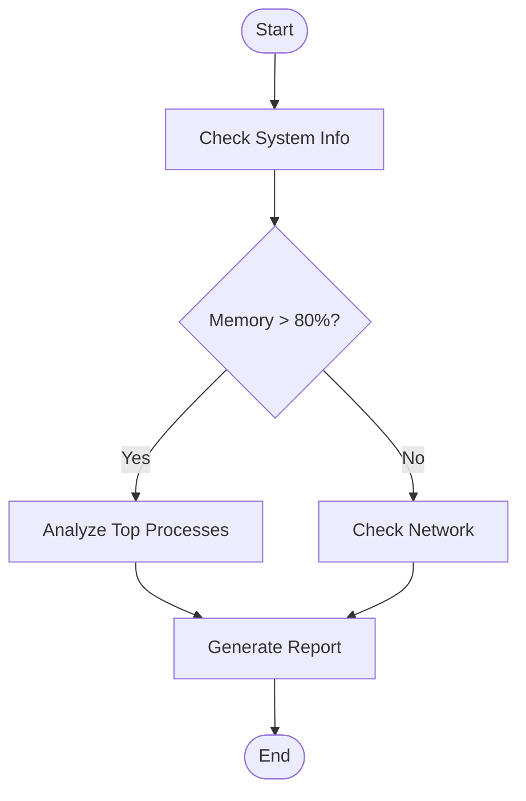

# OSQuery MCP Agent - Technical Design Guide

**Version**: 1.0  
**Last Updated**: November 10, 2025  
**Author**: System Architecture Team  

---

## Table of Contents

1. [Executive Summary](#executive-summary)
2. [Core Architecture](#core-architecture)
3. [Agent Patterns](#agent-patterns)
4. [Security Architecture](#security-architecture)
5. [Data Flow](#data-flow)
6. [Design Principles](#design-principles)
7. [Extension Points](#extension-points)
8. [Trade-offs and Decisions](#trade-offs-and-decisions)

---

## Executive Summary

The OSQuery MCP Agent is a **multi-pattern agentic system** that bridges AI models with system-level information through OSQuery. It supports three distinct agent patterns (MCP Direct, LangGraph Workflows, LangChain Autonomous) with enterprise-grade security.

### Key Capabilities

- **Real-time System Queries**: CPU, memory, processes, network, users
- **Enterprise Security**: RBAC, rate limiting, SQL injection protection, audit logging
- **Three Agent Patterns**: Direct protocol, visual workflows, autonomous reasoning
- **Production Ready**: Docker, monitoring, compliance reporting

### When to Use Each Pattern

| Pattern | Best For | Example Use Case |
|---------|----------|------------------|
| **MCP Direct** | IDE integration, real-time assistance | Claude Desktop asking "What's using memory?" |
| **LangGraph** | Multi-step workflows, visual design | Security audit: Check users → processes → network |
| **LangChain** | Complex analysis, natural language | "Find performance issues and suggest fixes" |

---

## Core Architecture

### 1. Multi-Layer Protocol Stack

The system is built as a **4-layer stack**, where each layer has a specific responsibility:

```
┌─────────────────────────────────────────────────────────────────────┐
│  LAYER 4: AI/Human Interface                                        │
│  ┌─────────────┐  ┌─────────────┐  ┌─────────────┐                 │
│  │ Claude IDE  │  │ Interactive │  │ Web Builder │                 │
│  │ Desktop     │  │ Terminal    │  │ Interface   │                 │
│  └─────────────┘  └─────────────┘  └─────────────┘                 │
│                                                                     │
│  Purpose: Natural language → Structured requests                   │
│  Technology: JSON-RPC, HTTP, CLI                                   │
└─────────────────────────────────────────────────────────────────────┘
                                ↓
┌─────────────────────────────────────────────────────────────────────┐
│  LAYER 3: Agent Orchestration                                       │
│  ┌──────────────┐  ┌──────────────┐  ┌──────────────┐              │
│  │ MCP Direct   │  │ LangGraph    │  │ LangChain    │              │
│  │ (Protocol)   │  │ (Workflow)   │  │ (Reasoning)  │              │
│  └──────────────┘  └──────────────┘  └──────────────┘              │
│                                                                     │
│  Purpose: Coordinate tool calls, manage state, apply logic         │
│  Technology: MCP SDK, LangGraph graphs, LangChain agents           │
└─────────────────────────────────────────────────────────────────────┘
                                ↓
┌─────────────────────────────────────────────────────────────────────┐
│  LAYER 2: Security & Policy                                         │
│  ┌──────────────┐  ┌──────────────┐  ┌──────────────┐              │
│  │ RBAC         │  │ Rate Limiter │  │ Audit Logger │              │
│  │ Validator    │  │              │  │              │              │
│  └──────────────┘  └──────────────┘  └──────────────┘              │
│                                                                     │
│  Purpose: Enforce policies, prevent abuse, maintain audit trail    │
│  Technology: Policy engine, token bucket, structured logging       │
└─────────────────────────────────────────────────────────────────────┘
                                ↓
┌─────────────────────────────────────────────────────────────────────┐
│  LAYER 1: OSQuery Execution                                         │
│  ┌──────────────┐  ┌──────────────┐  ┌──────────────┐              │
│  │ Query        │  │ Process      │  │ Result       │              │
│  │ Builder      │  │ Executor     │  │ Parser       │              │
│  └──────────────┘  └──────────────┘  └──────────────┘              │
│                                                                     │
│  Purpose: Execute SQL queries, fetch system data, parse results    │
│  Technology: osqueryi subprocess, JSON parsing, timeout handling   │
└─────────────────────────────────────────────────────────────────────┘
```

### 2. Layer Responsibilities

#### Layer 4: AI/Human Interface
- **Input**: Natural language queries, button clicks, API calls
- **Output**: Structured tool requests with parameters
- **Example**: "Show memory usage" → `call_tool("processes", {"limit": 10})`

#### Layer 3: Agent Orchestration
- **Input**: Tool requests from Layer 4
- **Processing**: Decide execution order, handle conditionals, manage state
- **Output**: Sequence of security-validated tool calls
- **Example**: Single query → [validate security] → [check rate limit] → [execute tool]

#### Layer 2: Security & Policy
- **Input**: Tool call attempts with user context
- **Processing**: Check permissions, enforce quotas, log activity
- **Output**: Approved/denied + audit record
- **Example**: Guest user → Denied on `custom_query`, Allowed on `system_info`

#### Layer 1: OSQuery Execution
- **Input**: Validated tool calls with SQL queries
- **Processing**: Execute subprocess, parse JSON, handle timeouts
- **Output**: Structured system data or error messages
- **Example**: `SELECT * FROM processes` → `[{pid: 123, name: "chrome", ...}]`

---

## Agent Patterns

### Pattern A: MCP Server (Direct Protocol)

#### Architecture

```python
# File: mcp_osquery_server/server.py

from mcp.server import Server
from mcp.types import Tool, CallToolResult

server = Server("osquery-mcp-server")

@server.list_tools()
async def list_tools() -> list[Tool]:
    """Registry of available tools"""
    return [
        Tool(
            name="system_info",
            description="Get system information",
            inputSchema={"type": "object", "properties": {}}
        ),
        # ... more tools
    ]

@server.call_tool()
async def call_tool(name: str, arguments: dict) -> CallToolResult:
    """Execute requested tool"""
    # 1. Dispatch to appropriate function
    # 2. Execute OSQuery
    # 3. Return formatted result
```

#### Design Decisions

**Why async/await?**
- Non-blocking I/O for concurrent queries
- Claude Desktop can query system while you type
- Multiple IDEs can connect simultaneously

**Why STDIO transport?**
- No network ports = no attack surface
- Works in corporate firewalls
- Secure by default (process isolation)

**Why decorator pattern?**
- Clean separation: tool definition vs. implementation
- Auto-generates JSON-RPC boilerplate
- Type-safe at compile time

#### Data Flow Example

```
[Claude Desktop]
    ↓
    "What processes are using the most memory?"
    ↓
[MCP Client] 
    ↓ JSON-RPC over STDIO
    {"method": "tools/call", "params": {"name": "processes", "arguments": {"limit": 5}}}
    ↓
[MCP Server - call_tool()]
    ↓
    osquery_tools.query_processes(5)
    ↓
    subprocess.run(["osqueryi", "--json", "SELECT pid, name, resident_size..."])
    ↓
    Parse JSON → Format response
    ↓
[Claude Desktop]
    ↓
    "Here are the top 5 processes: Chrome (2.3GB), Firefox (1.8GB)..."
```

#### When to Use
- ✅ IDE integration (Claude Desktop, Cursor, VS Code)
- ✅ Real-time assistance during development
- ✅ Stateless queries that don't require memory
- ❌ Complex multi-step workflows
- ❌ Conditional logic based on previous results

---

### Pattern B: LangGraph Workflows

#### Architecture

```python
# File: web_interface/workflow_builder.py

from dataclasses import dataclass
from enum import Enum

class NodeType(Enum):
    START = "start"          # Entry point
    TOOL = "tool"            # Execute OSQuery tool
    CONDITION = "condition"  # Branch based on data
    END = "end"              # Exit point

@dataclass
class WorkflowNode:
    id: str
    type: NodeType
    tool_name: Optional[str] = None
    parameters: Optional[Dict] = None
    condition: Optional[str] = None

@dataclass
class WorkflowEdge:
    from_node: str
    to_node: str
    condition: Optional[str] = None  # e.g., "if memory > 80%"
```

#### Visual Workflow Example



This translates to code:

```python
builder = WorkflowBuilder()

# Define nodes
builder.add_node("start", "Start", NodeType.START)
builder.add_node("system_check", "Check System", NodeType.TOOL, 
                 tool_name="system_info")
builder.add_node("memory_decision", "Memory Check", NodeType.CONDITION,
                 condition="data['physical_memory'] > threshold")
builder.add_node("process_analysis", "Analyze Processes", NodeType.TOOL,
                 tool_name="processes", parameters={"limit": 10})
builder.add_node("end", "End", NodeType.END)

# Define edges (transitions)
builder.add_edge("start", "system_check")
builder.add_edge("system_check", "memory_decision")
builder.add_edge("memory_decision", "process_analysis", 
                 condition="memory_high")
builder.add_edge("memory_decision", "end", 
                 condition="memory_normal")
builder.add_edge("process_analysis", "end")
```

#### Design Decisions

**Why graph-based?**
- **Visual clarity**: Non-programmers can understand workflows
- **Composability**: Reuse nodes across different workflows
- **Testability**: Each path through graph is a test case

**Why Mermaid diagrams?**
- **Documentation**: Diagram IS the documentation
- **Version control**: Text-based, diff-friendly
- **Rendering**: GitHub/GitLab render automatically

**Why separate Node/Edge?**
- **Single Responsibility**: Nodes = actions, Edges = transitions
- **Flexibility**: Same node can have multiple incoming/outgoing edges
- **Validation**: Easy to detect cycles, unreachable nodes

#### When to Use
- ✅ Multi-step security audits
- ✅ Scheduled health checks
- ✅ Compliance reporting workflows
- ✅ Visual workflow design for non-programmers
- ❌ Simple one-shot queries
- ❌ Workflows requiring deep reasoning

---

### Pattern C: LangChain Agent (Autonomous Reasoning)

#### Architecture

```python
# File: examples/langchain_agent.py

from langchain_core.tools import Tool
from langchain.agents import AgentExecutor, create_react_agent

class OSQueryAgent:
    def __init__(self):
        self.tools = self._create_tools()
        self.agent = create_react_agent(
            llm=ChatAnthropic(model="claude-3-5-sonnet"),
            tools=self.tools,
            prompt=REACT_PROMPT
        )
    
    def _create_tools(self) -> List[Tool]:
        """Wrap OSQuery functions as LangChain tools"""
        return [
            Tool(
                name="system_info",
                description="Get CPU, memory, OS details",
                func=self._system_info_wrapper
            ),
            Tool(
                name="processes",
                description="List running processes",
                func=self._processes_wrapper
            ),
            # ... more tools
        ]
    
    async def analyze(self, query: str) -> str:
        """Let LLM decide which tools to use"""
        return await self.agent.ainvoke({"input": query})
```

#### ReAct Loop Example

**User Query**: _"Is there a security issue on this system?"_

```
[LLM Reasoning - Step 1]
Thought: I should first check who has access to the system
Action: users
Action Input: {}

[Observation]
Found 15 users, 3 have root privileges: admin, deploy, backup

[LLM Reasoning - Step 2]  
Thought: I should check what processes these privileged users are running
Action: processes
Action Input: {"limit": 20}

[Observation]
User 'backup' is running a process with network access on port 22

[LLM Reasoning - Step 3]
Thought: I should check network connections to see if backup is actively connected
Action: network_connections
Action Input: {"limit": 50}

[Observation]
Port 22 has 3 active SSH connections from external IPs

[LLM Reasoning - Final]
Thought: I now have enough information to answer
Final Answer: Yes, there's a potential security concern. The 'backup' user has 
root privileges and is running SSH with 3 external connections. This should be 
reviewed to ensure it's authorized access.
```

#### Design Decisions

**Why LLM in the loop?**
- **Adaptability**: Handles queries never seen before
- **Context awareness**: Uses previous observations to inform next action
- **Natural language**: No need to pre-define all workflows

**Why ReAct pattern?**
- **Transparency**: See the LLM's reasoning process
- **Debuggability**: Know why a tool was chosen
- **Controllability**: Can interrupt/redirect at each step

**Why tool wrappers?**
- **Error handling**: Catch and format OSQuery errors for LLM
- **Result summarization**: LLM doesn't need raw JSON, just insights
- **Cost optimization**: Reduce token usage by summarizing data

#### When to Use
- ✅ Complex queries requiring intelligence ("Find anomalies")
- ✅ Exploratory analysis (user doesn't know exact steps)
- ✅ Natural language interfaces
- ✅ Adaptive workflows (different steps based on findings)
- ❌ Deterministic workflows (same steps every time)
- ❌ Cost-sensitive scenarios (LLM calls add up)
- ❌ Real-time low-latency requirements

---

## Security Architecture

### Defense in Depth Strategy

The system implements **4 layers of security**, each providing independent protection:

```
Request Flow:
    ↓
┌─────────────────────────────────────────┐
│ Layer 1: Authentication & RBAC          │
│                                         │
│ validate_request(user_id, tool, params) │
│     ↓                                   │
│ Check: Does user have role?             │
│ Check: Is tool allowed for role?        │
│ Check: Are parameters within limits?    │
│     ↓                                   │
│ Result: [] or [PolicyViolation(...)]    │
└─────────────────────────────────────────┘
    ↓ (if no violations)
┌─────────────────────────────────────────┐
│ Layer 2: Rate Limiting                  │
│                                         │
│ check_rate_limit(user_id, action)       │
│     ↓                                   │
│ Check: Token bucket (burst)             │
│ Check: Sliding window (sustained)       │
│     ↓                                   │
│ Result: {"allowed": bool, "remaining"}  │
└─────────────────────────────────────────┘
    ↓ (if allowed)
┌─────────────────────────────────────────┐
│ Layer 3: SQL Injection Prevention       │
│                                         │
│ _detect_sql_injection(sql_query)        │
│     ↓                                   │
│ Pattern match: OR '1'='1'               │
│ Pattern match: UNION SELECT             │
│ Pattern match: DROP/DELETE/INSERT       │
│ Pattern match: File operations          │
│     ↓                                   │
│ Result: [] or [PolicyViolation(...)]    │
└─────────────────────────────────────────┘
    ↓ (if no violations)
┌─────────────────────────────────────────┐
│ Layer 4: Audit Logging                  │
│                                         │
│ log_action(user, action, result)        │
│     ↓                                   │
│ Record: Event ID, timestamp             │
│ Record: User, session, IP               │
│ Record: Tool, parameters, result hash   │
│     ↓                                   │
│ Output: Structured JSON log             │
└─────────────────────────────────────────┘
```

### Role-Based Access Control (RBAC)

#### Role Hierarchy

```python
class AccessLevel(Enum):
    NONE = "none"      # No access
    READ = "read"      # View-only
    LIMITED = "limited"  # Specific tools
    FULL = "full"      # All tools except custom SQL
    ADMIN = "admin"    # Everything including custom SQL

# Predefined roles
ROLES = {
    "guest": SecurityRole(
        access_level=AccessLevel.READ,
        allowed_tools={"system_info"},
        allowed_tables={"system_info", "os_version"},
        max_query_complexity=10,
        max_result_rows=50,
        can_use_custom_queries=False
    ),
    
    "user": SecurityRole(
        access_level=AccessLevel.LIMITED,
        allowed_tools={"system_info", "processes", "users"},
        allowed_tables={"processes", "users", "system_info"},
        max_query_complexity=50,
        max_result_rows=500,
        can_use_custom_queries=False
    ),
    
    "analyst": SecurityRole(
        access_level=AccessLevel.FULL,
        allowed_tools={"*"},  # All tools
        allowed_tables={"*"},  # All tables except forbidden
        forbidden_tables={"shadow", "credentials"},
        max_query_complexity=200,
        max_result_rows=5000,
        can_use_custom_queries=True
    ),
    
    "admin": SecurityRole(
        access_level=AccessLevel.ADMIN,
        allowed_tools={"*"},
        allowed_tables={"*"},
        max_query_complexity=1000,
        max_result_rows=10000,
        can_use_custom_queries=True
    )
}
```

#### Permission Check Flow

```python
def validate_request(user_id: str, tool_name: str, parameters: dict):
    # Step 1: Get user's role
    role = get_user_role(user_id)
    if not role:
        return [PolicyViolation(
            violation_type=PolicyViolationType.UNAUTHORIZED_ACCESS,
            severity="high",
            message=f"User {user_id} has no assigned role",
            recommended_action="Assign appropriate role to user"
        )]
    
    # Step 2: Check tool access
    if tool_name not in role.allowed_tools and "*" not in role.allowed_tools:
        return [PolicyViolation(
            violation_type=PolicyViolationType.UNAUTHORIZED_ACCESS,
            severity="medium",
            message=f"Tool '{tool_name}' not allowed for role '{role.name}'",
            recommended_action="Use allowed tools or request permission"
        )]
    
    # Step 3: If custom query, validate SQL
    if tool_name == "custom_query":
        sql = parameters.get("sql", "")
        
        # Check query complexity
        complexity = calculate_complexity(sql)
        if complexity > role.max_query_complexity:
            return [PolicyViolation(
                violation_type=PolicyViolationType.SUSPICIOUS_PATTERN,
                severity="medium",
                message=f"Query complexity ({complexity}) exceeds limit",
                recommended_action="Simplify query"
            )]
        
        # Check SQL injection
        injection_violations = _detect_sql_injection(sql)
        if injection_violations:
            return injection_violations
    
    return []  # No violations
```

### Rate Limiting

#### Dual-Algorithm Approach

**Why two algorithms?**
- **Token Bucket**: Allows short bursts (good UX)
- **Sliding Window**: Prevents sustained abuse (good security)

```python
class RateLimiter:
    def __init__(self):
        # Token bucket: Allow 10 requests in quick succession
        self.bucket_capacity = 10
        self.refill_rate = 1  # 1 token per second
        
        # Sliding window: Max 100 requests per hour
        self.window_size = 3600  # 1 hour in seconds
        self.window_limit = 100
    
    def check_rate_limit(self, user_id: str, action: str) -> dict:
        # Check 1: Token bucket (burst protection)
        tokens_available = self._get_tokens(user_id)
        if tokens_available < 1:
            return {
                "allowed": False,
                "reason": "Burst limit exceeded",
                "retry_after": self._time_until_token()
            }
        
        # Check 2: Sliding window (sustained abuse protection)
        requests_in_window = self._count_requests_in_window(user_id)
        if requests_in_window >= self.window_limit:
            return {
                "allowed": False,
                "reason": "Hourly limit exceeded",
                "retry_after": self._window_reset_time()
            }
        
        # Both checks passed
        self._consume_token(user_id)
        self._record_request(user_id)
        
        return {
            "allowed": True,
            "remaining_burst": tokens_available - 1,
            "remaining_hourly": self.window_limit - requests_in_window - 1
        }
```

#### Rate Limit Examples

| Scenario | Bucket State | Window State | Result |
|----------|--------------|--------------|--------|
| First request | 10/10 tokens | 0/100 requests | ✅ Allowed |
| 10 rapid requests | 0/10 tokens | 10/100 requests | ✅ Last one allowed |
| 11th rapid request | 0/10 tokens | 10/100 requests | ❌ Denied (burst) |
| After 1 second | 1/10 tokens | 10/100 requests | ✅ Allowed |
| 100th request in hour | 5/10 tokens | 100/100 requests | ❌ Denied (window) |

### SQL Injection Prevention

#### Pattern Detection

```python
def _detect_sql_injection(sql_query: str) -> List[PolicyViolation]:
    """Multi-pattern SQL injection detection"""
    violations = []
    normalized = sql_query.lower().strip()
    
    # Pattern categories with severity
    patterns = [
        # Boolean-based injection (CRITICAL)
        (r"['\"];?\s*(or|and)\s*['\"]?\w+['\"]?\s*[=<>]", 
         "Boolean-based injection", "critical"),
        
        # Union-based injection (CRITICAL)
        (r"union\s+(all\s+)?select", 
         "Union-based injection", "critical"),
        
        # Stacked queries (CRITICAL)
        (r";\s*(drop|delete|insert|update|create)", 
         "Stacked queries", "critical"),
        
        # DDL/DML injection (CRITICAL)
        (r"^\s*(drop|delete|insert|update|create|alter)\s+", 
         "DDL/DML injection", "critical"),
        
        # Comment injection (HIGH)
        (r"(\/\*|\*\/|--|\#)", 
         "Comment injection", "high"),
        
        # Time-based injection (HIGH)
        (r"(benchmark|sleep|waitfor|delay)\s*\(", 
         "Time-based injection", "high"),
        
        # File operations (CRITICAL)
        (r"(load_file|into\s+outfile|into\s+dumpfile)", 
         "File operation injection", "critical"),
        
        # Stored procedures (HIGH)
        (r"(exec|execute|sp_|xp_)", 
         "Stored procedure injection", "high"),
        
        # Sensitive file access (CRITICAL)
        (r"where\s+path\s*=\s*['\"][^'\"]*/(etc|usr|var|home)", 
         "File system access injection", "critical"),
    ]
    
    for pattern, description, severity in patterns:
        if re.search(pattern, normalized):
            violations.append(PolicyViolation(
                violation_type=PolicyViolationType.SQL_INJECTION,
                severity=severity,
                message=f"Potential SQL injection: {description}",
                context={"query": sql_query, "pattern": pattern},
                recommended_action="Sanitize query and use parameterized statements"
            ))
    
    return violations
```

#### False Positive Handling

**Challenge**: Legitimate queries might match patterns
```sql
-- This is legitimate but matches comment pattern:
SELECT * FROM users WHERE name = 'John--Smith'
```

**Solution**: Context-aware validation
```python
# Allow comments in specific contexts
if self._is_in_string_literal(match_position, sql_query):
    continue  # Skip this match
```

### Audit Logging

#### Structured Logging Format

```json
{
  "event_id": "uuid-v4",
  "timestamp": "2025-11-10T18:43:12.235010+00:00",
  "event_type": "TOOL_EXECUTION",
  "severity": "LOW",
  "user_id": "user123",
  "session_id": "session-456",
  "tool_name": "processes",
  "parameters": {"limit": 10},
  "result_hash": "sha256-of-result",
  "execution_time_ms": 234,
  "source_ip": "192.168.1.100",
  "user_agent": "Claude Desktop/1.0",
  "error_message": null,
  "additional_data": {
    "query_complexity": 15,
    "rows_returned": 10
  }
}
```

#### Why Structured Logging?

| Benefit | Traditional Logs | Structured Logs |
|---------|------------------|-----------------|
| **Searchability** | grep/awk (slow) | SQL queries (fast) |
| **Analytics** | Manual parsing | Direct aggregation |
| **Compliance** | Manual audits | Automated reports |
| **Alerting** | Regex patterns | Field conditions |
| **Retention** | Rotation only | Smart archival |

#### Compliance Reports

```python
def generate_compliance_report(start_date, end_date):
    """Generate audit report for compliance"""
    logs = load_audit_logs(start_date, end_date)
    
    return {
        "period": f"{start_date} to {end_date}",
        "total_requests": len(logs),
        "unique_users": len(set(log["user_id"] for log in logs)),
        "tools_used": Counter(log["tool_name"] for log in logs),
        "security_violations": [
            log for log in logs 
            if log["event_type"] == "SECURITY_VIOLATION"
        ],
        "failed_requests": [
            log for log in logs
            if log["error_message"] is not None
        ],
        "average_execution_time": statistics.mean(
            log["execution_time_ms"] for log in logs
        )
    }
```

---

## Data Flow

### Complete Request Flow Example

**Scenario**: User asks _"Show me the top 5 memory-consuming processes"_

#### Step-by-Step Flow

```
┌─────────────────────────────────────────────────────────────────┐
│ STEP 1: User Input                                              │
├─────────────────────────────────────────────────────────────────┤
│ Natural Language: "Show me the top 5 memory-consuming processes"│
│                                                                 │
│ If using LangChain Agent:                                       │
│   LLM analyzes query → Selects "processes" tool → Sets limit=5 │
│                                                                 │
│ If using MCP Direct:                                            │
│   IDE sends: {"method": "tools/call",                           │
│               "params": {"name": "processes",                   │
│                         "arguments": {"limit": 5}}}             │
└─────────────────────────────────────────────────────────────────┘
                              ↓
┌─────────────────────────────────────────────────────────────────┐
│ STEP 2: Security Validation (Layer 2)                           │
├─────────────────────────────────────────────────────────────────┤
│ validate_request(user_id="user123",                             │
│                  tool_name="processes",                         │
│                  parameters={"limit": 5})                       │
│                                                                 │
│ Checks:                                                         │
│   ✓ User "user123" has role "user"                             │
│   ✓ Role "user" can access "processes" tool                    │
│   ✓ Limit (5) is within max_result_rows (500)                  │
│                                                                 │
│ Result: No violations                                           │
└─────────────────────────────────────────────────────────────────┘
                              ↓
┌─────────────────────────────────────────────────────────────────┐
│ STEP 3: Rate Limiting                                           │
├─────────────────────────────────────────────────────────────────┤
│ check_rate_limit(user_id="user123", action="processes")         │
│                                                                 │
│ Token Bucket:                                                   │
│   Current: 7/10 tokens                                          │
│   After: 6/10 tokens                                            │
│                                                                 │
│ Sliding Window:                                                 │
│   Current: 23/100 requests in last hour                         │
│   After: 24/100 requests                                        │
│                                                                 │
│ Result: {"allowed": true, "remaining_burst": 6,                 │
│          "remaining_hourly": 76}                                │
└─────────────────────────────────────────────────────────────────┘
                              ↓
┌─────────────────────────────────────────────────────────────────┐
│ STEP 4: OSQuery Execution (Layer 1)                             │
├─────────────────────────────────────────────────────────────────┤
│ query_processes(limit=5)                                        │
│   ↓                                                             │
│ Builds SQL:                                                     │
│   SELECT pid, name, uid, resident_size                          │
│   FROM processes                                                │
│   ORDER BY resident_size DESC                                   │
│   LIMIT 5;                                                      │
│   ↓                                                             │
│ Executes:                                                       │
│   subprocess.run([                                              │
│     "osqueryi",                                                 │
│     "--json",                                                   │
│     query                                                       │
│   ], timeout=30, capture_output=True)                           │
│   ↓                                                             │
│ Raw Output (JSON):                                              │
│   [{"pid":"1234", "name":"Chrome", "resident_size":"2400000"}...]│
└─────────────────────────────────────────────────────────────────┘
                              ↓
┌─────────────────────────────────────────────────────────────────┐
│ STEP 5: Result Processing                                       │
├─────────────────────────────────────────────────────────────────┤
│ Parse JSON → Validate schema → Format for display               │
│                                                                 │
│ Formatted Result:                                               │
│ {                                                               │
│   "success": true,                                              │
│   "data": [                                                     │
│     {                                                           │
│       "pid": "1234",                                            │
│       "name": "Chrome",                                         │
│       "uid": "501",                                             │
│       "resident_size": "2400000"  // 2.4 GB                     │
│     },                                                          │
│     ... 4 more processes                                        │
│   ],                                                            │
│   "query_time_ms": 234                                          │
│ }                                                               │
└─────────────────────────────────────────────────────────────────┘
                              ↓
┌─────────────────────────────────────────────────────────────────┐
│ STEP 6: Audit Logging                                           │
├─────────────────────────────────────────────────────────────────┤
│ log_action(user_id="user123",                                   │
│            action="processes",                                  │
│            resource="osquery",                                  │
│            result="success")                                    │
│                                                                 │
│ Writes to log:                                                  │
│ {                                                               │
│   "event_id": "evt-789",                                        │
│   "timestamp": "2025-11-10T18:43:12Z",                          │
│   "user_id": "user123",                                         │
│   "tool_name": "processes",                                     │
│   "parameters": {"limit": 5},                                   │
│   "execution_time_ms": 234,                                     │
│   "rows_returned": 5                                            │
│ }                                                               │
└─────────────────────────────────────────────────────────────────┘
                              ↓
┌─────────────────────────────────────────────────────────────────┐
│ STEP 7: Response to User                                        │
├─────────────────────────────────────────────────────────────────┤
│ If MCP Direct:                                                  │
│   JSON-RPC response → IDE → Display in chat                     │
│                                                                 │
│ If LangChain Agent:                                             │
│   LLM formats result into natural language:                     │
│   "Here are the top 5 processes by memory usage:                │
│    1. Chrome (PID 1234): 2.4 GB                                 │
│    2. Firefox (PID 5678): 1.8 GB                                │
│    ..."                                                         │
│                                                                 │
│ If LangGraph Workflow:                                          │
│   Passes data to next node in graph                             │
└─────────────────────────────────────────────────────────────────┘
```

### Error Handling Flow

```
┌─────────────────────────────────────────────────────────────────┐
│ Error Scenarios at Each Layer                                   │
├─────────────────────────────────────────────────────────────────┤
│                                                                 │
│ Layer 2 - Security:                                             │
│   Error: User has no role                                       │
│   Response: 403 Forbidden + PolicyViolation details             │
│   Audit: Log security violation                                 │
│                                                                 │
│ Layer 2 - Rate Limit:                                           │
│   Error: Too many requests                                      │
│   Response: 429 Too Many Requests + retry_after time            │
│   Audit: Log rate limit violation                               │
│                                                                 │
│ Layer 1 - OSQuery:                                              │
│   Error: osqueryi binary not found                              │
│   Response: 500 Internal Error + "OSQuery not installed"        │
│   Audit: Log system error                                       │
│                                                                 │
│ Layer 1 - Timeout:                                              │
│   Error: Query took > 30 seconds                                │
│   Response: 504 Gateway Timeout + "Query too complex"           │
│   Audit: Log performance issue                                  │
│                                                                 │
│ Layer 1 - Invalid SQL:                                          │
│   Error: Syntax error in SQL                                    │
│   Response: 400 Bad Request + SQL error message                 │
│   Audit: Log validation error                                   │
└─────────────────────────────────────────────────────────────────┘
```

---

## Design Principles

### 1. Separation of Concerns

**Principle**: Each component has ONE responsibility

```
✅ Good Design:
├── osquery_tools.py          # ONLY executes queries
├── security_policy.py         # ONLY enforces policies
├── rate_limiter.py           # ONLY manages quotas
└── audit_logger.py           # ONLY logs events

❌ Bad Design:
└── server.py                 # Does everything (query + security + logging)
```

**Why?**
- **Testability**: Test security without OSQuery installed
- **Maintainability**: Change rate limit algorithm without touching query code
- **Reusability**: Use security layer in other projects

### 2. Fail-Safe Defaults

**Principle**: Unknown/error states default to most secure option

```python
def get_user_role(user_id: str) -> SecurityRole:
    """Get user's role, defaults to most restrictive"""
    if user_id not in self.user_roles:
        # ✅ Default to guest (minimal permissions)
        return self.policies["default"].roles["guest"]
    
    # ❌ DO NOT default to admin or raise exception
```

**Examples**:
- Unknown user → Guest role (not error)
- Parsing error → Deny request (not allow)
- Missing security config → Strictest policy (not permissive)

### 3. Defense in Depth

**Principle**: Multiple independent security layers

```
Even if one layer fails, others still protect:

❌ Scenario: RBAC has a bug (allows unauthorized tool)
✅ Protected by: Rate limiter (prevents abuse)
✅ Protected by: SQL injection detector (prevents malicious queries)
✅ Protected by: Audit log (creates evidence trail)
```

### 4. Type Safety

**Principle**: Catch errors at compile time, not runtime

```python
# ✅ Good: Type-safe with Pydantic/dataclass
@dataclass
class PolicyViolation:
    violation_type: PolicyViolationType  # Enum
    severity: str                        # Could be Enum too
    message: str
    context: Dict[str, Any]

# Access violation properties
if violation.violation_type == PolicyViolationType.SQL_INJECTION:
    # IDE autocompletes, type checker validates

# ❌ Bad: Dictionary (errors at runtime)
violation = {
    "type": "sql_injection",  # Typo not caught
    "sevirity": "high",       # Typo not caught
}
```

### 5. Explicit Over Implicit

**Principle**: Make behavior obvious from code

```python
# ✅ Explicit: Clear what happens
def validate_request(user_id: str, 
                     tool_name: str, 
                     parameters: Dict[str, Any]) -> List[PolicyViolation]:
    """Returns empty list if valid, violations if not"""
    # Caller sees return type, knows to check length

# ❌ Implicit: Raises exception on failure
def validate_request(user_id: str, tool_name: str, parameters: Dict):
    """Raises SecurityError if invalid"""
    # Caller might forget try/except
```

### 6. Async First

**Principle**: All I/O operations are async

```python
# ✅ Async: Can handle multiple requests concurrently
@server.call_tool()
async def call_tool(name: str, arguments: dict) -> CallToolResult:
    result = await osquery_tools.query_processes_async(10)
    return format_result(result)

# While waiting for subprocess, can handle other requests

# ❌ Sync: Blocks entire server
def call_tool(name: str, arguments: dict):
    result = subprocess.run(...)  # Blocks for 30s
    return result
```

### 7. Observable by Default

**Principle**: System behavior is transparent

```
Every request generates:
1. Audit log entry (what happened)
2. Metrics (how long it took)
3. Error logs (if something failed)

Enables:
- Debugging: "Why was this request denied?"
- Monitoring: "Is the system healthy?"
- Compliance: "Who accessed what data?"
```

---

## Extension Points

### Adding New Tools

```python
# 1. Add OSQuery function
def query_docker_containers() -> dict:
    """New tool: Get Docker containers"""
    sql = "SELECT id, name, state FROM docker_containers"
    return custom_query(sql)

# 2. Register with MCP
@server.list_tools()
async def list_tools() -> list[Tool]:
    return [
        # ... existing tools ...
        Tool(
            name="docker_containers",
            description="List Docker containers",
            inputSchema={"type": "object", "properties": {}}
        )
    ]

# 3. Add to call_tool dispatcher
@server.call_tool()
async def call_tool(name: str, arguments: dict):
    if name == "docker_containers":
        result = osquery_tools.query_docker_containers()
        return format_result(result)
```

### Adding New Security Policies

```python
# 1. Define custom role
hipaa_analyst = SecurityRole(
    name="hipaa_analyst",
    access_level=AccessLevel.FULL,
    allowed_tools={"system_info", "processes", "network_*"},
    forbidden_tables={"users", "credentials"},  # PHI protection
    max_query_complexity=100,
    max_result_rows=1000,
    can_use_custom_queries=True
)

# 2. Create custom policy
hipaa_policy = SecurityPolicy(
    name="hipaa_compliance",
    description="HIPAA-compliant access policy",
    roles={"analyst": hipaa_analyst},
    global_forbidden_patterns=[
        r"SELECT.*password",
        r"SELECT.*ssn",
        r"SELECT.*medical_record"
    ],
    compliance_requirements={
        "audit_retention_days": 365,
        "require_encryption": True,
        "require_mfa": True
    }
)

# 3. Register policy
policy_engine = SecurityPolicyEngine()
policy_engine.policies["hipaa"] = hipaa_policy
```

### Adding New Workflow Nodes

```python
# 1. Extend NodeType enum
class NodeType(Enum):
    START = "start"
    TOOL = "tool"
    CONDITION = "condition"
    PARALLEL = "parallel"      # NEW: Run multiple tools concurrently
    AGGREGATE = "aggregate"    # NEW: Combine results
    END = "end"

# 2. Implement node logic
class ParallelNode(WorkflowNode):
    def execute(self, context: Dict) -> Dict:
        """Execute multiple tools in parallel"""
        tasks = [
            asyncio.create_task(self.execute_tool(tool))
            for tool in self.parallel_tools
        ]
        results = await asyncio.gather(*tasks)
        return {"parallel_results": results}
```

### Adding New Agent Patterns

```python
# Example: Add a "ScheduledAgent" pattern
class ScheduledAgent:
    """Runs workflows on a schedule"""
    
    def __init__(self, workflow: Workflow, schedule: str):
        self.workflow = workflow
        self.schedule = schedule  # cron format
        
    async def run(self):
        """Execute workflow on schedule"""
        while True:
            next_run = self._calculate_next_run()
            await asyncio.sleep(next_run - time.time())
            
            # Execute workflow
            result = await self.workflow.execute()
            
            # Send notification if issues found
            if result.has_violations():
                await self.notify_admin(result)
```

---

## Trade-offs and Decisions

### Design Decision Log

#### Decision 1: Why Three Agent Patterns?

**Context**: Could have built just one "best" pattern

**Considered Alternatives**:
1. **MCP Only**: Simple but inflexible
2. **LangChain Only**: Powerful but expensive (LLM calls)
3. **LangGraph Only**: Visual but requires workflow design

**Decision**: Support all three

**Rationale**:
- Different use cases have different constraints
- Users can start simple (MCP), grow complex (LangGraph), add intelligence (LangChain)
- Each pattern teaches different concepts

**Trade-offs**:
- ✅ Flexibility for different use cases
- ✅ Educational value (learn 3 approaches)
- ❌ More code to maintain
- ❌ Documentation complexity

---

#### Decision 2: Why STDIO Instead of HTTP?

**Context**: MCP protocol could use HTTP, WebSockets, or STDIO

**Considered Alternatives**:
1. **HTTP REST API**: Standard, well-known
2. **WebSockets**: Bidirectional, real-time
3. **STDIO**: Simple, secure

**Decision**: STDIO (follows MCP spec)

**Rationale**:
- No network ports = no attack surface
- Works in air-gapped environments
- Claude Desktop expects STDIO
- Process isolation is security feature

**Trade-offs**:
- ✅ Zero network configuration
- ✅ Secure by default
- ✅ Works in restrictive corporate environments
- ❌ Can't call from browser directly
- ❌ Requires process spawning

---

#### Decision 3: Why Async/Await?

**Context**: Could use synchronous or async Python

**Considered Alternatives**:
1. **Synchronous**: Simpler code
2. **Threading**: Concurrent execution
3. **Async/Await**: Non-blocking I/O

**Decision**: Async/Await

**Rationale**:
- OSQuery subprocess I/O is main bottleneck
- Can handle multiple Claude instances simultaneously
- MCP SDK uses async
- Better resource utilization

**Trade-offs**:
- ✅ Handle concurrent requests efficiently
- ✅ Better scalability
- ✅ Aligns with MCP SDK
- ❌ More complex error handling
- ❌ Requires Python 3.8+

---

#### Decision 4: Why Dataclasses Over Dictionaries?

**Context**: Could represent data as dicts or typed objects

**Considered Alternatives**:
1. **Dictionaries**: Flexible, JSON-compatible
2. **Dataclasses**: Type-safe, IDE support
3. **Pydantic**: Runtime validation

**Decision**: Dataclasses (with Pydantic for external boundaries)

**Rationale**:
- Type safety catches errors at development time
- IDE autocomplete improves developer experience
- Self-documenting code
- Easy serialization with `asdict()`

**Trade-offs**:
- ✅ Type safety and autocomplete
- ✅ Better documentation
- ✅ Compile-time error catching
- ❌ Slightly more verbose
- ❌ Requires Python 3.7+

---

#### Decision 5: Why Multiple Security Layers?

**Context**: Could rely on just RBAC for security

**Considered Alternatives**:
1. **RBAC Only**: Simple, standard
2. **RBAC + Rate Limiting**: Prevents abuse
3. **RBAC + Rate Limiting + SQL Injection + Audit**: Defense in depth

**Decision**: All four layers

**Rationale**:
- No single security measure is perfect
- Compliance requires audit trail
- Production systems need rate limiting
- SQL injection is common attack vector

**Trade-offs**:
- ✅ Enterprise-grade security
- ✅ Compliance-ready
- ✅ Multiple fail-safes
- ❌ More complex configuration
- ❌ Slight performance overhead

---

#### Decision 6: Why Structured Logging (JSON)?

**Context**: Could use plain text logs

**Considered Alternatives**:
1. **Plain Text**: Human-readable, simple
2. **JSON**: Machine-parseable, structured
3. **Binary**: Compact, fast

**Decision**: JSON structured logging

**Rationale**:
- Easy to query with standard tools (jq, SQL)
- Compliance reports need structured data
- Modern log aggregation tools expect JSON
- Still human-readable with pretty-printing

**Trade-offs**:
- ✅ Easy to analyze and query
- ✅ Compliance-friendly
- ✅ Works with ELK, Splunk, etc.
- ❌ Larger log files than plain text
- ❌ Slightly less readable raw

---

## Conclusion

This agent system demonstrates **production-ready design** through:

1. **Flexibility**: Three patterns for different use cases
2. **Security**: Four-layer defense in depth
3. **Scalability**: Async architecture for concurrency
4. **Maintainability**: Separation of concerns, type safety
5. **Observability**: Comprehensive audit logging
6. **Extensibility**: Clear extension points

The design prioritizes **real-world requirements** (security, compliance, performance) while maintaining **developer experience** (type safety, clear APIs, good documentation).

### Further Reading

- `docs/ARCHITECTURE.md` - Detailed system architecture
- `docs/TECHNICAL_SPECS.md` - API specifications
- `docs/INTERACTION_DIAGRAMS.md` - Sequence diagrams
- `examples/` - Working code examples

### Feedback

This is a living document. If you find areas that need clarification or additional detail, please contribute!
