# OSQuery MCP Server - Enterprise Architecture Documentation

## System Overview

The OSQuery MCP Server is an enterprise-grade Model Context Protocol (MCP) server that provides intelligent system analysis capabilities through multiple orchestration patterns. It enables AI models, applications, and workflows to query and analyze system state with advanced security, monitoring, and automation features.

## Multi-Orchestration Architecture

The platform provides **three distinct orchestration approaches** for different use cases:

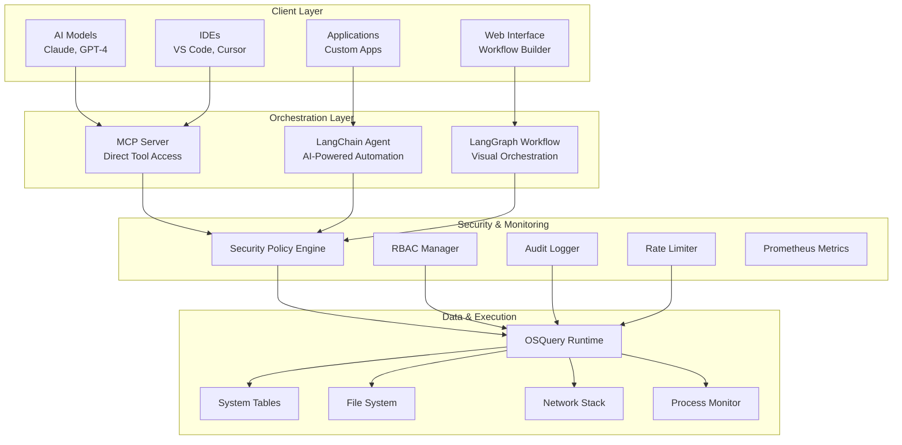

## Orchestration Patterns

### 1. **Direct MCP Pattern** (AI Models & IDEs)

**Use Case**: Immediate tool access for AI models and development environments.

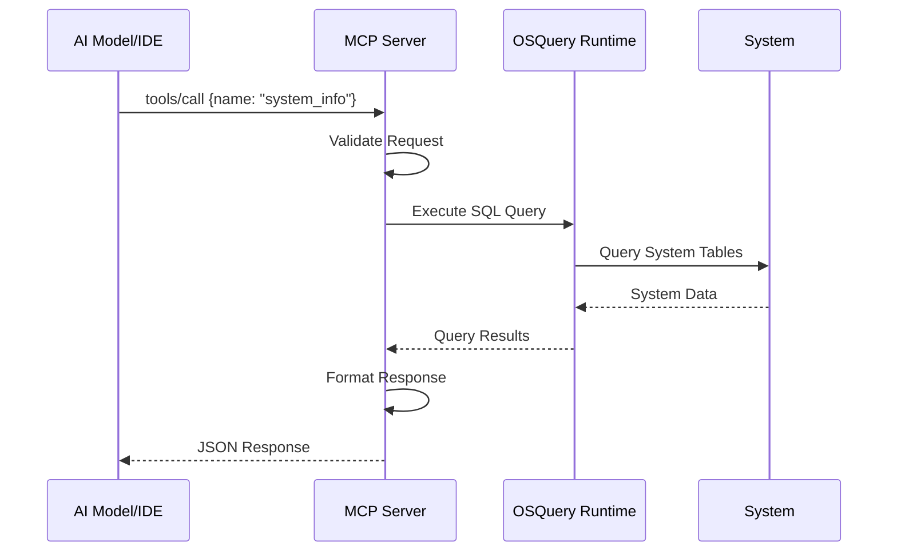

**Architecture Components**:
- **Protocol**: JSON-RPC over STDIO
- **Interface**: Synchronous tool calls
- **Security**: Basic request validation
- **Performance**: <200ms response time

### 2. **LangChain Agent Pattern** (Intelligent Automation)

**Use Case**: AI-powered analysis with natural language understanding and tool selection.

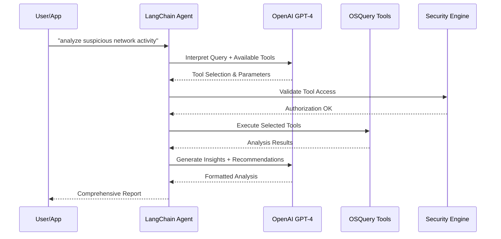

**Architecture Components**:
- **Intelligence**: GPT-4 for query interpretation
- **Tools**: Dynamic tool selection and chaining
- **Security**: RBAC and policy enforcement
- **Performance**: 2-5s response time with caching

### 3. **LangGraph Workflow Pattern** (Visual Orchestration)

**Use Case**: Complex multi-step analysis with state management and conditional logic.

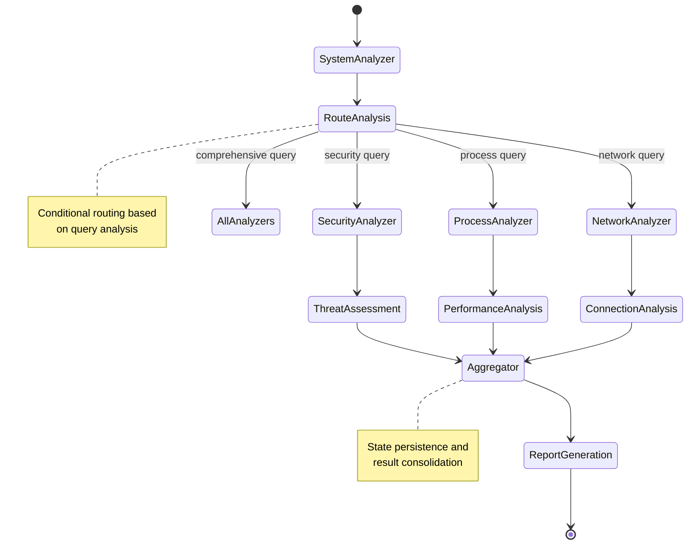

**Architecture Components**:
- **State Management**: Persistent workflow state with checkpointing
- **Conditional Logic**: AI-driven routing decisions
- **Parallel Execution**: Concurrent node processing
- **Performance**: 8-15s for complex workflows

## Detailed Component Architecture

### Core Server Architecture

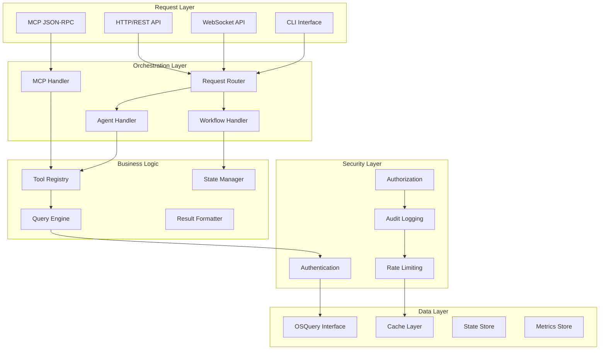
    P --> R
    
### Component Responsibilities

| Component | Purpose | Key Features |
|-----------|---------|--------------|
| **MCP Server** | Direct tool access for AI models | JSON-RPC, real-time queries, Claude Desktop integration |
| **LangChain Agent** | Intelligent automation with LLMs | Natural language processing, tool selection, context awareness |
| **LangGraph Workflow** | Visual workflow orchestration | State management, conditional routing, parallel execution |
| **Security Engine** | Enterprise security controls | RBAC, audit logging, SQL injection protection, rate limiting |
| **Web Interface** | Visual workflow builder | Drag-drop design, real-time testing, workflow templates |
| **Monitoring System** | Observability and metrics | Prometheus metrics, distributed tracing, health checks |

## Security Architecture

### Multi-Layer Security Design

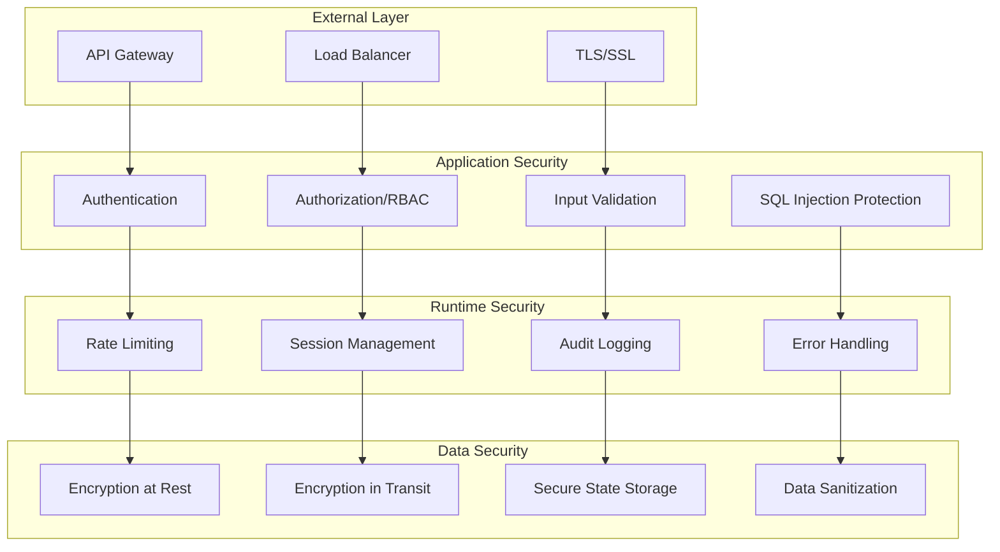

### Security Policy Engine Architecture

```python
class SecurityPolicyEngine:
    """
    Centralized security policy enforcement
    """
    
    Components:
    ┌─────────────────────────────────────────────────────────────────┐
    │                    Security Policy Engine                       │
    ├─────────────────────────────────────────────────────────────────┤
    │                                                                 │
    │  ┌───────────────┐  ┌───────────────┐  ┌───────────────┐      │
    │  │   RBAC        │  │   Policy      │  │   SQL Inject  │      │
    │  │   Manager     │  │   Validator   │  │   Detector    │      │
    │  │               │  │               │  │               │      │
    │  │ • Roles       │  │ • Rules       │  │ • Patterns    │      │
    │  │ • Permissions │  │ • Violations  │  │ • Validation  │      │
    │  │ • Users       │  │ • Actions     │  │ • Mitigation  │      │
    │  └───────────────┘  └───────────────┘  └───────────────┘      │
    │                                                                 │
    │  ┌───────────────┐  ┌───────────────┐  ┌───────────────┐      │
    │  │   Audit       │  │   Rate        │  │   Session     │      │
    │  │   Logger      │  │   Limiter     │  │   Manager     │      │
    │  │               │  │               │  │               │      │
    │  │ • Events      │  │ • Limits      │  │ • Tokens      │      │
    │  │ • Compliance  │  │ • Throttling  │  │ • Timeout     │      │
    │  │ • Analytics   │  │ • Quotas      │  │ • Validation  │      │
    │  └───────────────┘  └───────────────┘  └───────────────┘      │
    └─────────────────────────────────────────────────────────────────┘
```

## Data Flow Architecture

### Request Processing Flow

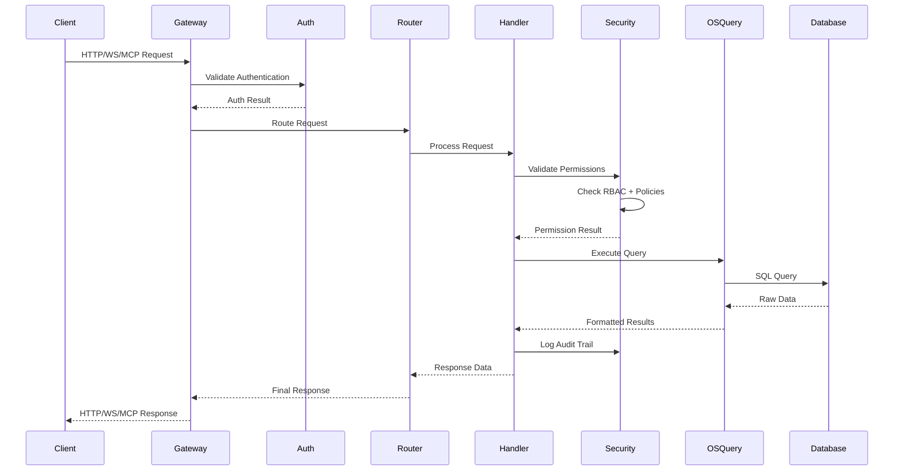

### State Management Flow (LangGraph)

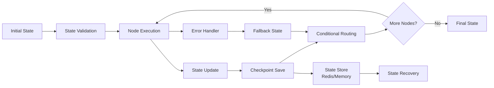

## Deployment Architecture

### Container Architecture

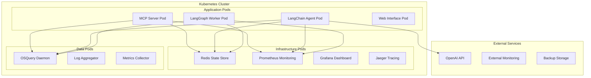

### Service Mesh Architecture

```yaml
# Istio Service Mesh Configuration
apiVersion: networking.istio.io/v1alpha3
kind: VirtualService
metadata:
  name: osquery-mcp-routing
spec:
  http:
  - match:
    - uri:
        prefix: /api/mcp
    route:
    - destination:
        host: mcp-server
        port:
          number: 8080
  - match:
    - uri:
        prefix: /api/agent
    route:
    - destination:
        host: langchain-agent
        port:
          number: 8081
  - match:
    - uri:
        prefix: /api/workflow
    route:
    - destination:
        host: langgraph-worker
        port:
          number: 8082
```

## Performance Architecture

### Caching Strategy

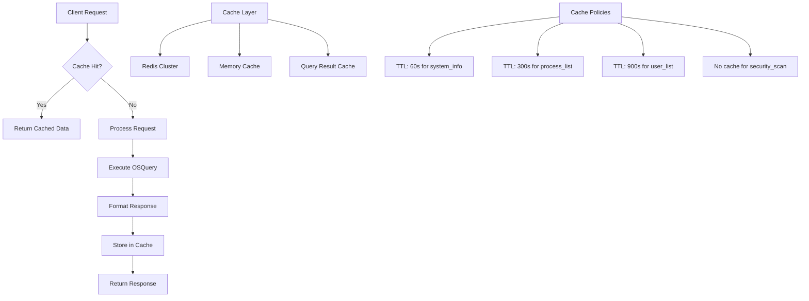

### Load Balancing Strategy

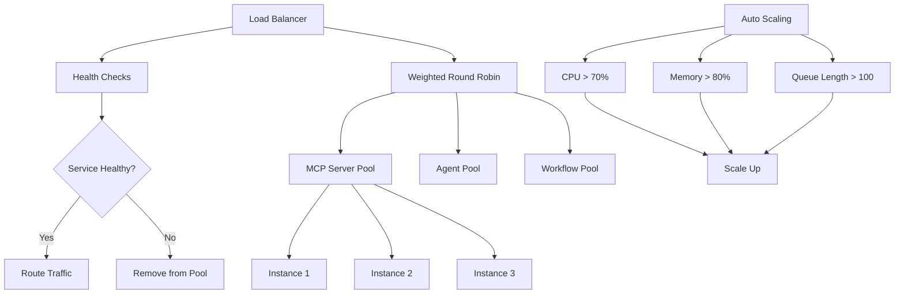

## Monitoring Architecture

### Observability Stack

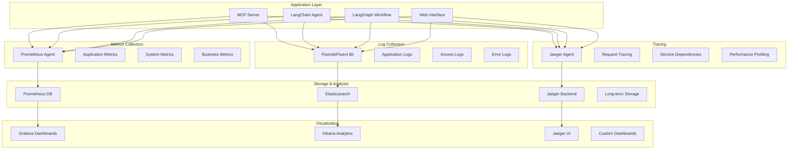

### Key Performance Indicators

| Metric Category | Metrics | Targets |
|-----------------|---------|---------|
| **Availability** | Uptime, Health Check Success | 99.9% uptime |
| **Performance** | Response Time, Throughput | <200ms P95, >1000 RPS |
| **Reliability** | Error Rate, Success Rate | <0.1% error rate |
| **Security** | Auth Failures, Policy Violations | <10 violations/day |
| **Resource Usage** | CPU, Memory, Disk | <70% average usage |
| **Business** | Query Success, Analysis Accuracy | >95% success rate |

## Integration Architecture

### External Integrations

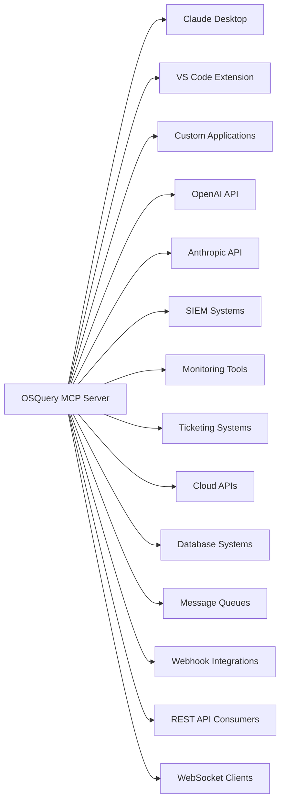

### Plugin Architecture

```python
class PluginArchitecture:
    """
    Extensible plugin system for custom integrations
    """
    
    Structure:
    ┌─────────────────────────────────────────────────────────────────┐
    │                        Plugin System                            │
    ├─────────────────────────────────────────────────────────────────┤
    │                                                                 │
    │  ┌───────────────┐  ┌───────────────┐  ┌───────────────┐      │
    │  │   Tool        │  │   Workflow    │  │   Security    │      │
    │  │   Plugins     │  │   Plugins     │  │   Plugins     │      │
    │  │               │  │               │  │               │      │
    │  │ • Custom OSQ  │  │ • Node Types  │  │ • Auth Providers │    │
    │  │ • Data Sources│  │ • Conditions  │  │ • Policy Rules   │    │
    │  │ • Formatters  │  │ • Actions     │  │ • Validators     │    │
    │  └───────────────┘  └───────────────┘  └───────────────┘      │
    │                                                                 │
    │  ┌───────────────┐  ┌───────────────┐  ┌───────────────┐      │
    │  │   Integration │  │   Monitoring  │  │   Storage     │      │
    │  │   Plugins     │  │   Plugins     │  │   Plugins     │      │
    │  │               │  │               │  │               │      │
    │  │ • API Clients │  │ • Collectors  │  │ • Databases   │      │
    │  │ • Webhooks    │  │ • Alerting    │  │ • Caches      │      │
    │  │ • Transforms  │  │ • Dashboards  │  │ • State Stores│      │
    │  └───────────────┘  └───────────────┘  └───────────────┘      │
    └─────────────────────────────────────────────────────────────────┘
```

## Scalability Architecture

### Horizontal Scaling Pattern

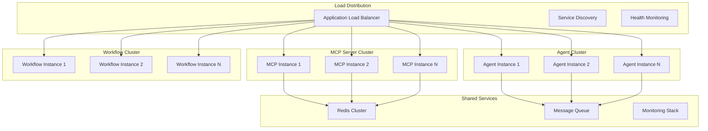

### Auto-Scaling Configuration

```yaml
# Kubernetes HPA Configuration
apiVersion: autoscaling/v2
kind: HorizontalPodAutoscaler
metadata:
  name: osquery-mcp-hpa
spec:
  scaleTargetRef:
    apiVersion: apps/v1
    kind: Deployment
    name: osquery-mcp-server
  minReplicas: 3
  maxReplicas: 20
  metrics:
  - type: Resource
    resource:
      name: cpu
      target:
        type: Utilization
        averageUtilization: 70
  - type: Resource
    resource:
      name: memory
      target:
        type: Utilization
        averageUtilization: 80
  - type: Pods
    pods:
      metric:
        name: active_requests
      target:
        type: AverageValue
        averageValue: "100"
```

## Disaster Recovery Architecture

### Backup and Recovery Strategy

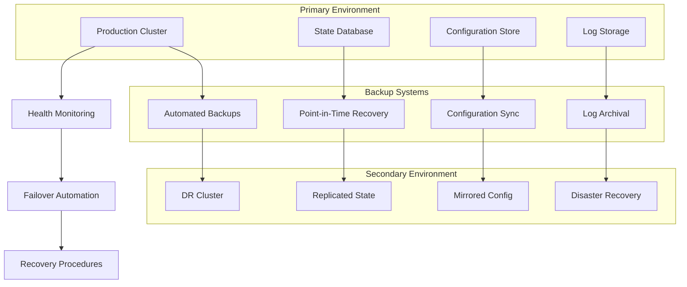

## Future Architecture Considerations

### Planned Enhancements

1. **Microservices Architecture**: Break down monolithic components into microservices
2. **Event-Driven Architecture**: Implement event sourcing and CQRS patterns
3. **Multi-Region Deployment**: Global load balancing and data replication
4. **AI/ML Integration**: Enhanced intelligent routing and anomaly detection
5. **Blockchain Integration**: Immutable audit trails and smart contracts
6. **Edge Computing**: Distributed OSQuery nodes with edge processing

### Scalability Targets

| Component | Current | Target 2025 | Target 2026 |
|-----------|---------|-------------|-------------|
| **Requests/Second** | 1,000 | 10,000 | 100,000 |
| **Concurrent Users** | 100 | 1,000 | 10,000 |
| **Data Processing** | 1GB/day | 100GB/day | 1TB/day |
| **Global Regions** | 1 | 3 | 10 |
| **Node Count** | 10 | 100 | 1,000 |

---

*Last Updated: November 10, 2025*
*Version: 2.0.0*
└──────────────────────────────────────────────────────────────────────────────────┘
```

### 2. OSQuery Tools Layer (`mcp_osquery_server/osquery_tools.py`)

```python
┌──────────────────────────────────────────────────────────────────────────────────┐
│                             OSQuery Tools                                       │
├──────────────────────────────────────────────────────────────────────────────────┤
│                                                                                  │
│  ┌─────────────────────┐    ┌─────────────────────┐    ┌─────────────────────┐  │
│  │   OSQueryClient     │    │   Query Functions   │    │   Result Processor  │  │
│  │                     │    │                     │    │                     │  │
│  │ • Path resolution   │    │ • System info       │    │ • JSON parsing      │  │
│  │ • Process execution │◄───┤ • Process queries   │───►│ • Error handling    │  │
│  │ • Timeout handling  │    │ • Network queries   │    │ • Data validation   │  │
│  │ • Error recovery    │    │ • Custom SQL        │    │ • Type conversion   │  │
│  │                     │    │                     │    │                     │  │
│  └─────────────────────┘    └─────────────────────┘    └─────────────────────┘  │
│                                                                                  │
├──────────────────────────────────────────────────────────────────────────────────┤
│                           System Interface                                      │
│                          • subprocess execution                                 │
│                          • osqueryi binary                                      │
│                          • 30-second timeout                                    │
└──────────────────────────────────────────────────────────────────────────────────┘
```

### 3. System Integration Layer

```
┌──────────────────────────────────────────────────────────────────────────────────┐
│                            Operating System                                     │
├──────────────────────────────────────────────────────────────────────────────────┤
│                                                                                  │
│  ┌─────────────────────┐    ┌─────────────────────┐    ┌─────────────────────┐  │
│  │   System Tables     │    │   Process Monitor   │    │   Network Monitor   │  │
│  │                     │    │                     │    │                     │  │
│  │ • system_info       │    │ • processes         │    │ • interface_details │  │
│  │ • users             │    │ • process_open_*    │    │ • process_open_*    │  │
│  │ • os_version        │    │ • memory_usage      │    │ • listening_ports   │  │
│  │ • uptime            │    │                     │    │                     │  │
│  └─────────────────────┘    └─────────────────────┘    └─────────────────────┘  │
│                                                                                  │
│  ┌─────────────────────┐    ┌─────────────────────┐    ┌─────────────────────┐  │
│  │   File System      │    │   Package Manager   │    │   Service Manager   │  │
│  │                     │    │                     │    │                     │  │
│  │ • mounts            │    │ • programs          │    │ • launchd (macOS)   │  │
│  │ • file             │    │ • packages          │    │ • systemd (Linux)   │  │
│  │ • disk_events      │    │ • rpm_packages      │    │ • services          │  │
│  │                     │    │                     │    │                     │  │
│  └─────────────────────┘    └─────────────────────┘    └─────────────────────┘  │
│                                                                                  │
└──────────────────────────────────────────────────────────────────────────────────┘
```

## Data Flow Architecture

### Request Flow

```
1. User Query
   │
   ├─ "Show me top 5 processes by memory"
   │
   v
2. Claude/AI Model
   │
   ├─ Natural Language Processing
   ├─ Intent Recognition
   ├─ Tool Selection: "processes"
   │
   v
3. MCP Client
   │
   ├─ JSON-RPC Request
   ├─ Method: "call_tool"
   ├─ Parameters: {"name": "processes", "arguments": {"limit": 5}}
   │
   v
4. MCP Server (server.py)
   │
   ├─ Request Validation
   ├─ Tool Dispatch
   ├─ Async Execution
   │
   v
5. OSQuery Tools (osquery_tools.py)
   │
   ├─ SQL Generation: "SELECT pid, name, uid, resident_size FROM processes ORDER BY resident_size DESC LIMIT 5;"
   ├─ Process Execution
   ├─ Result Processing
   │
   v
6. OSQuery Binary (osqueryi)
   │
   ├─ SQL Execution
   ├─ System Table Access
   ├─ JSON Output
   │
   v
7. Response Flow (Reverse)
   │
   ├─ JSON Data
   ├─ Error Handling
   ├─ Format Validation
   ├─ MCP Response
   ├─ Claude Processing
   ├─ User Response
```

### Error Handling Flow

```
┌─────────────────┐     ┌─────────────────┐     ┌─────────────────┐
│                 │     │                 │     │                 │
│   Client Error  │     │   Server Error  │     │  System Error   │
│                 │     │                 │     │                 │
└─────────┬───────┘     └─────────┬───────┘     └─────────┬───────┘
          │                       │                       │
          v                       v                       v
┌─────────────────────────────────────────────────────────────────────┐
│                      Error Handler                                 │
├─────────────────────────────────────────────────────────────────────┤
│                                                                     │
│  ┌─────────────────┐  ┌─────────────────┐  ┌─────────────────┐     │
│  │   Validation    │  │   Logging       │  │   Recovery      │     │
│  │                 │  │                 │  │                 │     │
│  │ • Input check   │  │ • Error details │  │ • Retry logic   │     │
│  │ • Type safety   │  │ • Stack trace   │  │ • Fallback      │     │
│  │ • Range limits  │  │ • Context info  │  │ • Graceful fail │     │
│  └─────────────────┘  └─────────────────┘  └─────────────────┘     │
│                                                                     │
│  Result: Structured Error Response with isError=true               │
└─────────────────────────────────────────────────────────────────────┘
```

## Security Architecture

### Multi-Layer Security Model

```
┌─────────────────────────────────────────────────────────────────────────────────┐
│                              Security Layers                                   │
├─────────────────────────────────────────────────────────────────────────────────┤
│                                                                                 │
│  ┌─────────────────────────────────────────────────────────────────────────┐   │
│  │                        Application Layer                                │   │
│  │                                                                         │   │
│  │  • API Key Management (.env files)                                     │   │
│  │  • Git Secret Protection (.gitignore)                                  │   │
│  │  • Environment Isolation (virtual env)                                 │   │
│  │  • Input Validation (Pydantic schemas)                                 │   │
│  │                                                                         │   │
│  └─────────────────────────────────────────────────────────────────────────┘   │
│                                                                                 │
│  ┌─────────────────────────────────────────────────────────────────────────┐   │
│  │                         Protocol Layer                                 │   │
│  │                                                                         │   │
│  │  • JSON-RPC over STDIO (no network exposure)                           │   │
│  │  • Type-safe interfaces (CallToolResult)                               │   │
│  │  • Timeout protection (30s limit)                                      │   │
│  │  • Error containment (exception handling)                              │   │
│  │                                                                         │   │
│  └─────────────────────────────────────────────────────────────────────────┘   │
│                                                                                 │
│  ┌─────────────────────────────────────────────────────────────────────────┐   │
│  │                          System Layer                                  │   │
│  │                                                                         │   │
│  │  • User-level permissions (no sudo by default)                         │   │
│  │  • Read-only system access (osquery tables)                            │   │
│  │  • SQL injection protection (parameterized)                            │   │
│  │  • Resource limits (query timeouts)                                    │   │
│  │                                                                         │   │
│  └─────────────────────────────────────────────────────────────────────────┘   │
│                                                                                 │
└─────────────────────────────────────────────────────────────────────────────────┘
```

## Performance Architecture

### Optimization Strategies

```
┌─────────────────────────────────────────────────────────────────────────────────┐
│                           Performance Optimizations                            │
├─────────────────────────────────────────────────────────────────────────────────┤
│                                                                                 │
│  ┌─────────────────────┐    ┌─────────────────────┐    ┌─────────────────────┐ │
│  │   Async Processing  │    │   Query Optimization│    │   Resource Management│ │
│  │                     │    │                     │    │                     │ │
│  │ • Non-blocking I/O  │    │ • LIMIT clauses     │    │ • 30s timeout       │ │
│  │ • Concurrent tools  │◄───┤ • Indexed columns   │───►│ • Memory limits     │ │
│  │ • Event-driven      │    │ • Efficient joins   │    │ • Process cleanup   │ │
│  │ • Async/await       │    │                     │    │                     │ │
│  └─────────────────────┘    └─────────────────────┘    └─────────────────────┘ │
│                                                                                 │
│  ┌─────────────────────┐    ┌─────────────────────┐    ┌─────────────────────┐ │
│  │   Caching Strategy  │    │   Error Handling    │    │   Monitoring        │ │
│  │                     │    │                     │    │                     │ │
│  │ • Client instance   │    │ • Fast failures     │    │ • Query timing      │ │
│  │ • Path caching      │◄───┤ • Circuit breakers  │───►│ • Error rates       │ │
│  │ • Result streaming  │    │ • Graceful degrader │    │ • Resource usage    │ │
│  │                     │    │                     │    │                     │ │
│  └─────────────────────┘    └─────────────────────┘    └─────────────────────┘ │
│                                                                                 │
└─────────────────────────────────────────────────────────────────────────────────┘
```

## Deployment Architecture

### Development Environment

```
┌─────────────────────────────────────────────────────────────────────────────────┐
│                            Development Setup                                   │
├─────────────────────────────────────────────────────────────────────────────────┤
│                                                                                 │
│  ┌─────────────────────┐    ┌─────────────────────┐    ┌─────────────────────┐ │
│  │   Local Environment │    │   Version Control   │    │   Security Config   │ │
│  │                     │    │                     │    │                     │ │
│  │ • Python 3.12.3     │    │ • Git repository    │    │ • .env files        │ │
│  │ • Virtual env       │◄───┤ • .gitignore rules  │───►│ • API key mgmt      │ │
│  │ • VS Code tasks     │    │ • Branch strategy   │    │ • Secret protection │ │
│  │ • osquery binary    │    │                     │    │                     │ │
│  └─────────────────────┘    └─────────────────────┘    └─────────────────────┘ │
│                                                                                 │
└─────────────────────────────────────────────────────────────────────────────────┘
```

### Production Deployment

```
┌─────────────────────────────────────────────────────────────────────────────────┐
│                           Production Architecture                               │
├─────────────────────────────────────────────────────────────────────────────────┤
│                                                                                 │
│  ┌─────────────────────────────────────────────────────────────────────────┐   │
│  │                          AI Model Integration                           │   │
│  │                                                                         │   │
│  │  ┌─────────────────┐    ┌─────────────────┐    ┌─────────────────┐      │   │
│  │  │   Claude API    │    │   Cursor IDE    │    │   Custom Client │      │   │
│  │  └─────────────────┘    └─────────────────┘    └─────────────────┘      │   │
│  │                                   │                                     │   │
│  └───────────────────────────────────┼─────────────────────────────────────┘   │
│                                      │                                         │
│  ┌───────────────────────────────────┼─────────────────────────────────────┐   │
│  │                          MCP Configuration                              │   │
│  │                                   │                                     │   │
│  │  ┌─────────────────┐    ┌─────────▼─────────┐    ┌─────────────────┐   │   │
│  │  │   Settings JSON │    │   MCP Server      │    │   Process Mgmt  │   │   │
│  │  └─────────────────┘    └───────────────────┘    └─────────────────┘   │   │
│  │                                   │                                     │   │
│  └───────────────────────────────────┼─────────────────────────────────────┘   │
│                                      │                                         │
│  ┌───────────────────────────────────┼─────────────────────────────────────┐   │
│  │                          System Resources                               │   │
│  │                                   │                                     │   │
│  │  ┌─────────────────┐    ┌─────────▼─────────┐    ┌─────────────────┐   │   │
│  │  │   OSQuery       │    │   System Tables   │    │   Permissions   │   │   │
│  │  └─────────────────┘    └───────────────────┘    └─────────────────┘   │   │
│  │                                                                         │   │
│  └─────────────────────────────────────────────────────────────────────────┘   │
│                                                                                 │
└─────────────────────────────────────────────────────────────────────────────────┘
```

## Technology Stack

### Core Dependencies

| Component | Technology | Version | Purpose |
|-----------|------------|---------|---------|
| **Protocol** | Model Context Protocol | 1.21.0 | AI-tool communication |
| **Language** | Python | 3.12.3 | Core implementation |
| **Validation** | Pydantic | 2.12.4 | Type safety & validation |
| **Environment** | python-dotenv | 1.2.1 | Configuration management |
| **AI Integration** | Anthropic | 0.72.0 | Claude API client |
| **System Queries** | OSQuery | 5.x | System information access |

### Development Stack

| Component | Technology | Purpose |
|-----------|------------|---------|
| **Editor** | VS Code | Development environment |
| **Version Control** | Git | Source code management |
| **Package Manager** | pip/venv | Dependency management |
| **Documentation** | Markdown | Technical documentation |
| **Testing** | Python unittest | Quality assurance |

## Extension Points

### Adding New Tools

```python
# 1. Define query function in osquery_tools.py
def query_new_feature() -> Dict[str, Any]:
    """Query new system feature."""
    client = get_client()
    return client.query("SELECT * FROM new_table;")

# 2. Register tool in server.py
Tool(
    name="new_feature",
    description="Get new system feature information",
    inputSchema={
        "type": "object",
        "properties": {
            "param": {"type": "string", "description": "Parameter"}
        },
        "required": []
    }
)

# 3. Add handler in call_tool()
elif name == "new_feature":
    result = osquery_tools.query_new_feature()
```

### Custom Query Extensions

```sql
-- Security monitoring
SELECT pid, name, cmdline FROM processes WHERE cmdline LIKE '%password%';

-- Network analysis
SELECT protocol, local_address, remote_address, state 
FROM process_open_sockets 
WHERE state = 'ESTABLISHED';

-- System performance
SELECT name, interval, executions, avg_system_time 
FROM osquery_schedule;
```

## Best Practices

### 1. Security Guidelines
- Never commit `.env` files
- Use least-privilege access
- Validate all inputs
- Implement proper timeouts
- Log security events

### 2. Performance Guidelines
- Use LIMIT clauses in queries
- Implement proper error handling
- Cache expensive operations
- Monitor resource usage


## Alternate orchestrator: LangChain + LangGraph

As an optional alternate design, you can use LangChain with LangGraph to
orchestrate the same osquery tool callables. This approach is useful when
you want graph-based planning, richer LLM-driven control flow, or a visual
authoring surface for tool workflows.

This repository includes a lightweight adapter (`langgraph_adapter.py`) that
returns a serializable design map when the runtime packages are not
installed, and a runtime-friendly representation when `langchain` and
`langgraph` are available. See `docs/ALTERNATE_DESIGN_LANGCHAIN.md` for
detailed tradeoffs and a quick-start.

Notes:
- Keep `mcp_osquery_server/osquery_tools.py` as the canonical implementation
   of tools. The LangGraph design should map graph nodes to those callables.
- Installing the optional packages is required only if you plan to run the
   LangChain/Graph runtime. The adapter itself is safe to import without
   those packages.

- Use async/await patterns

### 3. Maintenance Guidelines
- Regular dependency updates
- Monitor osquery versions
- Test on target platforms
- Document configuration changes
- Backup configuration files

---

**Architecture Version**: 1.0  
**Last Updated**: November 9, 2025  
**Compatibility**: MCP 1.21.0, Python 3.12+, OSQuery 5.x